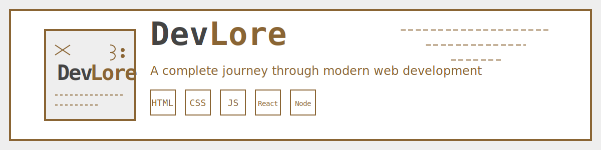

#  DevLore

<p align="center">
  
</p>

<div align="center">
  <strong>A complete journey through modern web development</strong><br>
  From HTML basics to advanced React and Node.js
</div>

<div align="center">
  <h3>
    <a href="https://devlore.app">
      Website
    </a>
    <span> | </span>
    <a href="https://devlore.app/tracks">
      Learning Tracks
    </a>
    <span> | </span>
    <a href="https://devlore.app/about">
      About
    </a>
    <span> | </span>
    <a href="https://github.com/yourusername/devlore/issues">
      Issues
    </a>
  </h3>
</div>

<div align="center">
  
  
  
  
</div>

<br>

## 🚀 Overview

DevLore is a comprehensive web development learning platform built to guide developers from the basics of HTML, CSS, and JavaScript to advanced concepts in React, Node.js, and modern web development practices.

With a retro-inspired design and structured learning paths, DevLore provides an engaging environment to master the art of web development.

<div align="center">
  
</div>

## ✨ Features

- 📚 **Structured Learning Tracks** - Follow carefully designed paths from fundamentals to advanced concepts
- 💻 **Interactive Code Examples** - Try out code directly in your browser
- 📝 **Practical Projects** - Build your portfolio with real-world projects
- 🔍 **Searchable Content** - Quickly find the topics you're interested in
- 📱 **Responsive Design** - Learn on any device with a fully responsive interface
- 🌙 **Light/Dark Mode** - Choose your preferred theme for comfortable learning

## 📋 Learning Tracks

DevLore offers multiple learning tracks to guide you through the world of web development:

- **HTML Fundamentals** - Structure, semantics, and the backbone of the web
- **CSS & Design** - Styling, layouts, and visual enhancement
- **JavaScript** - Interactivity, DOM manipulation, and modern ES6+
- **React Framework** - Components, state management, and modern UI development
- **Node.js & Express** - Server-side JavaScript, APIs, and backend development
- **Databases** - SQL, NoSQL, and data management strategies

## 🛠️ Tech Stack

DevLore is built with modern web technologies:

- **[Next.js](https://nextjs.org/)** - React framework for server-rendered applications
- **[Tailwind CSS](https://tailwindcss.com/)** - Utility-first CSS framework
- **[TypeScript](https://www.typescriptlang.org/)** - Type-safe JavaScript
- **[MDX](https://mdxjs.com/)** - Markdown with JSX for interactive content

## 📦 Installation

```bash
# Clone the repository
git clone https://github.com/AchrafELGhazi/devlore.git

# Navigate to the directory
cd devlore

# Install dependencies
npm install

# Start the development server
npm run dev
```

## 🖼️ Screenshots

<div align="center">
  
  
</div>

## 🤝 Contributing

Contributions are welcome! Whether you're fixing bugs, adding features, or improving documentation, your help is appreciated.

1. Fork the repository
2. Create your feature branch (`git checkout -b feature/amazing-feature`)
3. Commit your changes (`git commit -m 'Add some amazing feature'`)
4. Push to the branch (`git push origin feature/amazing-feature`)
5. Open a Pull Request

Please see our [Contributing Guidelines](CONTRIBUTING.md) for more details.

## 📝 License

DevLore is open source software [licensed as MIT](LICENSE).
